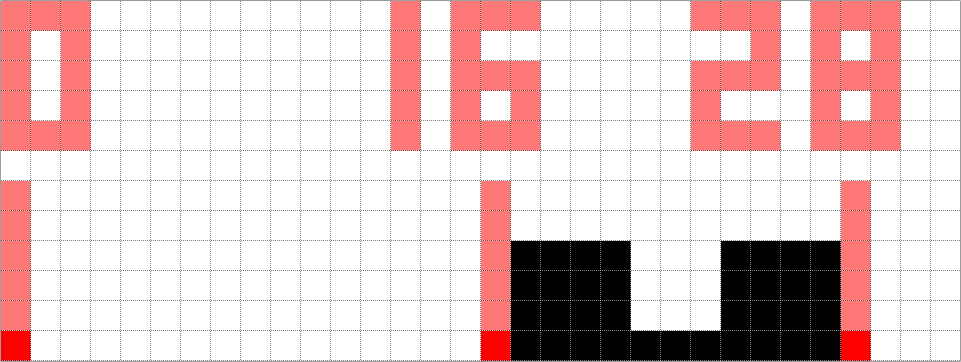
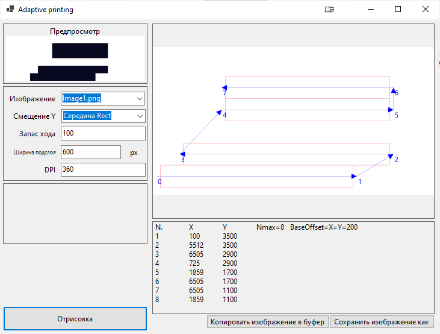
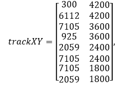
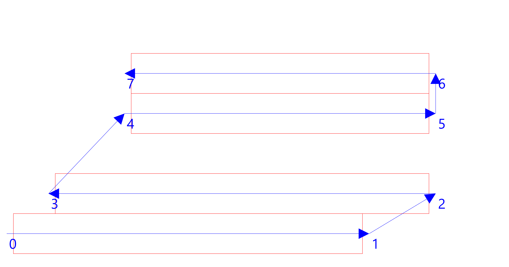
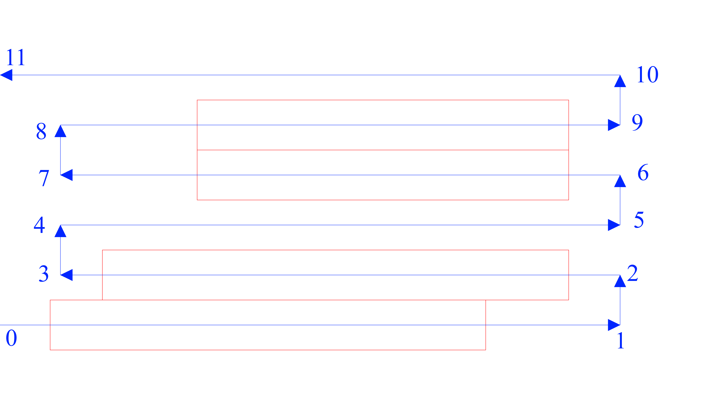
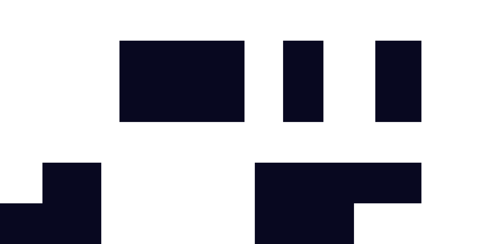

Adaptive Printing
=================
Основной код представлен в TrackBuilder.cs

### Описание
Алгоритм адаптивной печати позволяет сократить холостые ходы печати и
сформировать быстрые и рабочие перемещения печатного узла. Данный алгоритм
применим и для других технологий аддитивной печати, реализующих послойную,
последовательную, чередующую направления печать.
Основан на модификации траектории печати «Змейкой» путем анализа каждого
отдельного растрового слоя и оптимизации печатных процессов.
#### Алгоритм включает в себя:
1) учет смещения запаса хода для получения оптимального качества печати
(необходимо время на разгон и торможение),
2) учет размера рабочего пространства для оптимального построения траектории,
3) учет пустых подслоёв для пропуска печати данных пустых подслоёв.
Представлена визуализация анализа слоя и создания траектории движения.
Произведен анализ стабильности и скорости работы алгоритма, путем многократного
запуска и процедурной генерации входных данных с сравнением с исходными данными
генерации.
Данный алгоритм запускается перед формированием задания печати каждого слоя.
#### Состоит из следующих подзадач:
1) Разделение слоя на подслои.
Данная операция производится по причине реализации печати по одной оси X, на 3д принтере. Из данной причины создаётся вторая – ограничение по
ширине печатающей головки.
2) Определение границ каждого подслоя.
Проходим по ширине подслоя и находим начало и конец содержимого печати. Упрощая,
находим минимальное начало и максимальный конец содержимого. Пример разметки
фигуры представлен на рисунке ниже, от 16 до 28 пикселей позиции по ширине.
3) Определение пустых подслоёв. Пример разметки пустоты представлен на рисунке
ниже, от 0 до 16 пикселей позиции по ширине.

5) Построение оптимальной траектории с учетом запаса смещения от границ подслоя,
пустых подслоев и размера рабочего пространства.
6) Передача данных на ПЛК. В нашем случае визуализация полученного результата
Разработан данный алгоритм на языке C\# в среде Visual Studio, легко
преобразуется в C++, Structured Text и другие.
Для визуализации созданных траекторий можно использовать простой графический интерфейс.

[Описание параметров]

**Опыт 1**
В качестве проверки алгоритма использовано входное изображение и параметры, представленные в таблице ниже

| **Параметр**                | **Значение**                 |
| --------------------------- | ---------------------------- |
| Исходное изображение        | 7200x3600 пикселей           |
| Ширина печати за 1 проход   | 600 пикселей                 |
| Запас хода                  | 300 пикселей                 |
| Разрешение печати           | 36 DPI (уменьшено для опыта) |
| Количество подизображений   | 6                            |
| Начальный отсчет траектории | С центра                     |
| Смещение нуля               | 300 пикселей                 |

Данный алгоритм возвращает матрицу координат начала печати каждого подслоя,
визуализацию данной траектории, разметку адаптивной печати на слое.
Координаты начала печати каждого подслоя [X1 Y1; X2 Y2 ;… …; Xn Yn]:

На рисунке ниже представлена траектория начала печати каждого подслоя при
использовании алгоритма адаптивной печати. 

На рисунке ниже представлена траектория
обычной печати «змейкой».

Сравнивая траектории, можно заметить, что вместо того, чтобы проходить
печатным узлом с начала до конца каждого подслоя, алгоритм сообщает, что можно
сократить путь.

#### Описание траектории адаптивной печати:

* 0-1 проход) Начало печати производится с начала координат (в нашем случае,
смещено на 300 для размещение графических разметок). Прямая печать до конца
полезного содержимого подслоя.
* 1-2 проход) После завершения печати первого подслоя, проходим дополнительно на
запас хода, затем перемещаемся по диагонали в начало печати 2 подслоя.
* 2-3 проход) Обратная печать до конца полезного содержимого подслоя
* 3-4 проход) Определили, что следующий проход пустой, перемещаем печатный узел по
диагонали к следующему подслою.
* 4-5 проход) Прямая печать до конца полезного содержимого подслоя.
* 5-6 проход) Перемещение по высоте к следующему подслою
* 6-7 проход) Обратная печать до конца полезного содержимого подслоя.
* 7-0 проход) Завершение печати. Возвращение в начало координат и подготовка к
печати следующего слоя.

В других принтерах можно продолжить с 7 прохода траектории печати.
Выходные данные алгоритма предаются на ПЛК 3д принтера, который отвечает за
перемещение печатного узла по рабочей зоне. Так как для печати необходим сигнал
энкодера только с главной печатной оси (в разработанном принтере – оси Х), то перемещение по другим осям не сбивает
процесс печати. По оси Y перемещаемся, когда заканчиваем печать подслоя.
Существуют ограничения алгоритма, намерено пропускаются полости внутри подслоёв
изображения. **Опыт 2**. При использовании входного изображения, представленного на
рисунке ниже и тех же параметров, представленных в таблице выше, получим такой же
результат, что и в 1 опыте. Результаты совпадают, так как алгоритм ищет
минимальное начало, максимальный конец полезного содержимого подслоя.

Тестирование
=================
Тестирование алгоритма производится в отдельном проекте тестирования алгоритма с
использованием подхода модульных тестирований.
Описания тестов для алгоритма адаптивной печати:
| Тип тестирования | Имя                      | Описание                                                                                                                                                                                                                                                                                                                                                                                                                       |
| ---------------- | ------------------------ | ------------------------------------------------------------------------------------------------------------------------------------------------------------------------------------------------------------------------------------------------------------------------------------------------------------------------------------------------------------------------------------------------------------------------------ |
| Обычное          | BuildTrack_ExternalImage | Алгоритм повторяется N раз. Загружается внешнее изображение, выполняется алгоритм, затем заведомо правильные выходные данные сверяются с фактическими. Тест пройден, если за N раз правильные и фактические данные совпали на 100%                                                                                                                                                                                             |
| Генеративное     | BuildTrack_InternalImage | Алгоритм повторяется N раз. Изображение генерируется, из генератора извлекаются правильные выходные данные, выполняется алгоритм, затем правильные выходные данные сверяются с фактическими. Тест пройден, если за N раз правильные и фактические данные совпали на 100%                                                                                                                                                       |
| Генеративное     | Full_InternalImage       | Изображение генерируется N раз, из генератора извлекаются правильные выходные данные, выполняется алгоритм, затем правильные выходные данные сверяются с фактическими. Тест пройден, если за N раз правильные и фактические данные совпали на 100%. Отличие алгоритма от BuildTrack_InternalImage заключается в проверке каждого шага в алгоритме,   в отличии от проверки конечного результата в BuildTrack_InternalImage. |
| Обычное          | TestBuildTrack           | Загружается внешнее изображение, выполняется алгоритм, затем заведомо правильные выходные данные сверяются с фактическими. Проверяется созданный трек. Тест пройден, если правильные и фактические данные совпали на 100%                                                                                                                                                                                                      |
| Обычное          | TestFindRectangle        | Загружается внешнее изображение, выполняется алгоритм, затем заведомо правильные выходные данные сверяются с фактическими. Проверяется правильное определение начала и конца полезного содержимого. Тест пройден, если правильные и фактические данные совпали на 100%                                                                                                                                                         |
| Обычное          | TestBaseOffset           | Загружается внешнее изображение, выполняется алгоритм, затем заведомо правильные выходные данные сверяются с фактическими. Проверяется правильное смещение нуля. Тест пройден, если правильные и фактические данные совпали на 100%                                                                                                                                                                                            |

Скачать
=================
Вы можете скачать простой графический интерфейс для визуализации созданных
траекторий по ссылке ниже
